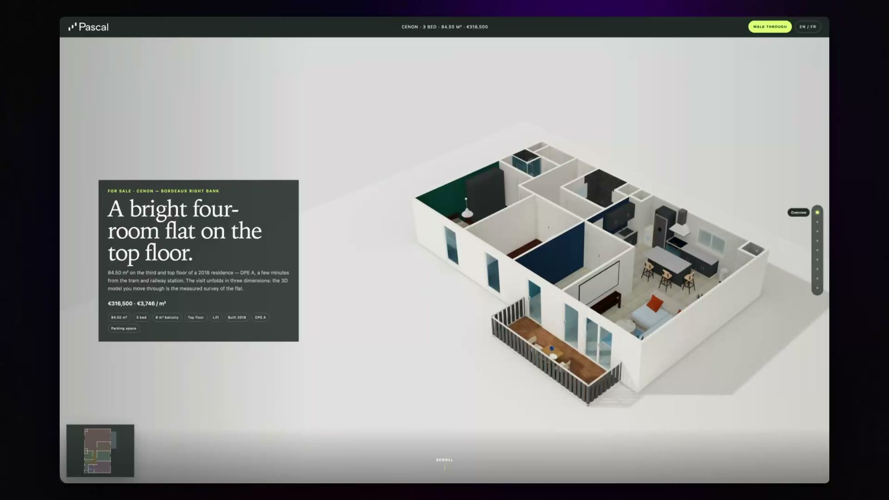

# Pascal · Cenon T4 — a property listing you scroll through in 3D

<!-- Video: replace the image link below with a bare github.com/user-attachments/assets/<uuid> URL
     on its own line (drag the mp4 into any GitHub comment box to mint one) for an inline player. -->

[](https://demo-listing-cenon.vercel.app)

**[▶ Live demo](https://demo-listing-cenon.vercel.app)** · [download the video](https://github.com/pascalorg/demo-listing-cenon/releases/download/v1.0.0/cenon-apt-listing-github.mp4)

A real four-room flat in Cenon (Bordeaux right bank), presented as a scroll-driven cinematic story
built directly on a **Pascal capture** — the GLB you fly through *is* the surveyed model of the
apartment, at its original metre scale. No procedural stand-in geometry, no separate "3D section":
the model is the page.

Bun + Vite, vanilla ES modules, Three.js WebGPU/TSL with an explicit WebGL2 fallback. No framework.

## Run

```sh
bun install
bun run dev     # open the URL Vite prints
```

`bun run build` produces a portable static `dist/`; `bun run preview` serves it.

## What it does

**The story.** Nine beats scroll from an aerial of the model down through the flat. Camera paths are
hand-tuned waypoint curves, and the transitions pass *through* the building: the balcony French door
swings open as the camera enters the séjour, a bedroom window opens to let it in from outside, the
suite's pocket door opens on the way to the shower room. Every opening is scrubbed by scroll
position — reverse the scroll and it closes — and stays consistent across deep links and reloads.

**The look.** On WebGPU the scene renders through a screen-space GI pipeline (SSGI with real bounced
light, recurrent denoise, TRAA) on a bounded convergence budget, then idles: nothing renders while
nothing moves. `?look=sketch` swaps in the lighter stylised pass with ink outlines and no GI.
WebGL2 browsers get the authored PBR scene directly, with shadows and IBL.

**The plan.** A generated SVG plan drawn from the model's own polygons, with official areas for
display. Hovering a room highlights it in the 3D model and vice-versa; clicking flies to that room,
where the camera can be freely orbited. A persistent mini-plan tracks the live camera position and
field-of-view cone.

**Free visit.** "Visiter librement" takes pointer lock directly: WASD to walk, Shift to run, and a
centre reticle that picks up doors within reach — click or `E` to open them. Escape returns you to
the exact scroll position you left.

**Daylight.** The balcony beat carries a time-of-day scrub using a solar approximation for Cenon
(44.857, −0.522), with the balcony's north-east edge mapped to world +X.

**Two languages.** FR is the primary voice, EN the mirror; the default follows the browser, and an
explicit choice persists.

## Interactive and development flags

| Flag | Effect |
|---|---|
| `?look=sketch` | Ink-outline stylised pass instead of the default realistic SSGI look |
| `?dpr=N` | Override the DPR cap (clamped 0.75–2, still bounded by the device) — useful for screen recording |
| `?gi=low\|med\|high` | SSGI cost tier on the WebGPU real look; `high` is the default |
| `?pose` | Live camera-pose overlay. `C` copies a paste-ready pose (with beat and transition progress); `F` enters unconstrained fly mode — mouse look, WASD, Q/E, Shift to accelerate, wheel for speed, `[` `]` for FOV |
| `?calib=sejour\|chambre1\|salledeau` | Photo-calibration overlay for matching model cameras to photographs |
| `?forceWebGL=1` | Force the WebGL2 fallback path |

## Assets

- `public/assets/model/apartment.glb` — the authored Pascal model; must stay in its original coordinate system.
- `public/assets/data/layout.json` — opening and fence metadata; runtime zone geometry comes from the GLB extras.
- `public/assets/photos/` — the listing photographs, several matched to model cameras.
- `public/assets/renders/` — seven 1920px staging projections (séjour and Chambre 1) decoded on selection.
- `public/assets/diagnostics/` — the official DPE A (48 kWhEP/m²/an) and GES C (11 kgéqCO₂/m²/an) charts.

Three.js is pinned and self-hosted at `0.185.1`. Desktop DPR is capped at 1.5, coarse-pointer at 1.25.

## Documentation

- [`docs/SPEC.md`](docs/SPEC.md) — the product contract: content, copy, beat-by-beat behaviour.
- [`docs/TECH_NOTES.md`](docs/TECH_NOTES.md) — GLB and scene-graph reconnaissance, layout mapping, Pascal viewer technique notes.
- [`docs/rounds/`](docs/rounds) — the build log: one evidence report per development round, with the
  screenshots and measurements each change was verified against.
